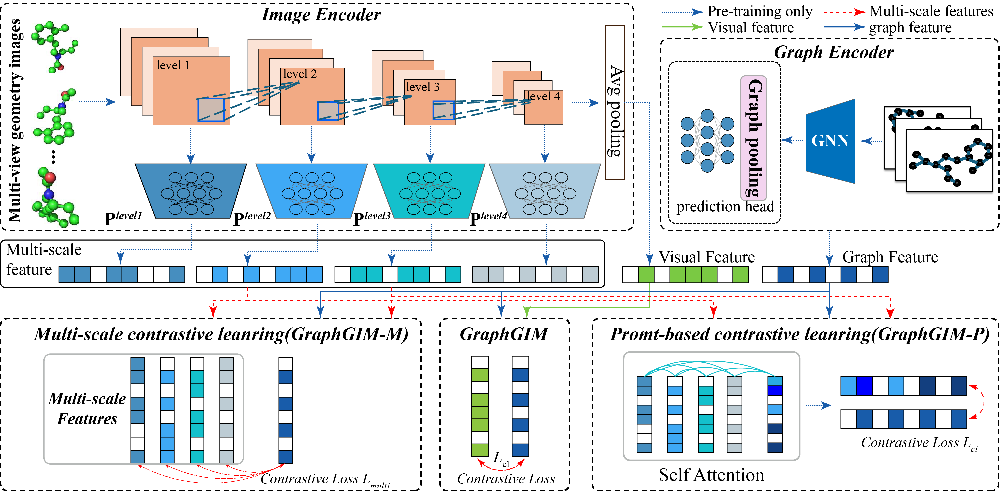

<h1 align="center">  📃GraphGIM: Rethinking Molecular Graph Contrastive Learning via Geometry Image Modeling  </h1>
Official PyTorch-based implementation in the paper GraphGIM: Rethinking Molecular Graph Contrastive Learning via Geometry Image Modeling, which contains a simple contrastive learning framework called GraphGIM and two variants (GraphGIM-M and GraphGIM-P).
<div>
<a href="https://github.com/cyli029/GraphGIM/blob/main/LICENSE">
    
</a>
</div>


## 🆕 News

- \[**August 2024**\] We propose [GraphGIM](https://github.com/cyli029/GraphGIM), a Molecular Graph Contrastive Learning Framework.

## Abstract
Learning molecular representations is crucial for accurate drug discovery. Using graphs to represent molecules is a popular solution and many researchers have used contrastive learning (CL) to improve the generalization of molecular graph representations. In this work, we revisit existing graph-based CL methods and find that these methods have limited diversity in the constructed sample pairs, resulting in insufficient performance gains. To alleviate the above challenge, we propose a novel molecular graph CL method via geometry image modeling, called GraphGIM, which enhances the diversity between sample pairs. GraphGIM is pre-trained on 2 million 2D graphs and multi-view 3D geometry images through CL. Furthermore, we find that as the convolutional layers processing the image become deeper, the information of feature maps gradually changes from global molecular-level information to local atomic-level information, which provides chemical information at different scales. Therefore, we propose two variants to further improve the performance of GraphGIM, called GraphGIM-M and GraphGIM-P, which fuse feature maps of different scales in the image using a weighted strategy and a prompt-based strategy, respectively. Extensive experiments show that GraphGIM and its two variants outperform state-of-the-art graph CL methods on eight molecular property prediction benchmarks from MoleculeNet and achieve competitive results with state-of-the-art methods.




## Environments

#### 1. GPU environment
CUDA 11.6
Ubuntu 20.04
Miniconda conda3
Python 3.8

#### 2. create conda environment
```bash
# create conda env
conda create -n GraphGIM python=3.8.10
source activate GraphGIM
# install environment
pip install torch==1.13.0+cu116 torchvision==0.14.0+cu116 torchaudio==0.13.0+cu116 --extra-index-url https://download.pytorch.org/whl/cu116 -i https://pypi.tuna.tsinghua.edu.cn/simple

pip install timm==1.0.3
pip install tensorboard
pip install scikit-learn
pip install pandas
pip install numpy
pip install torch-cluster 1.6.0+pt113cu116 torch-scatter torch-sparse torch-spline-conv -f https://pytorch-geometric.com/whl/torch-1.13.1%2Bcu116.html
pip install torch-geometric==2.5.3
pip install dgl-1.0.0+cu116
pip install ogb
pip install tqdm

